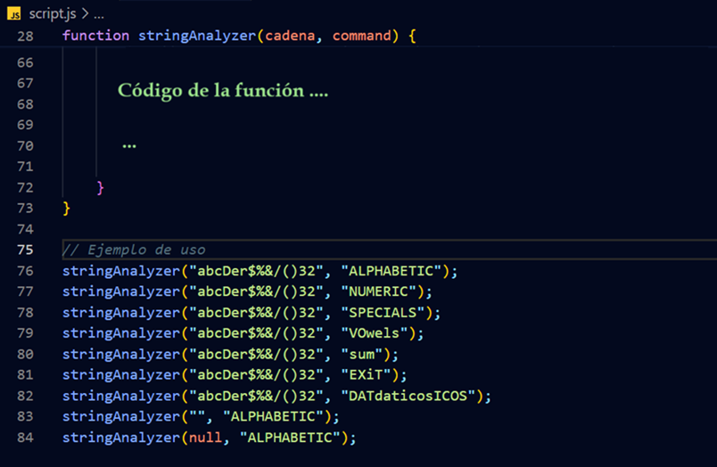
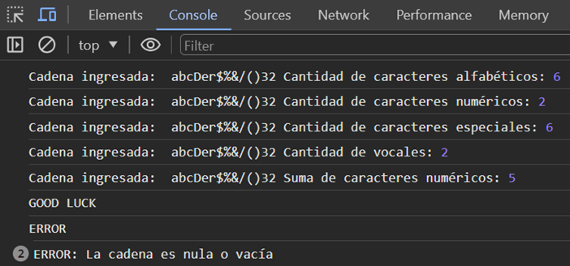

# Ejercicio 2: Analizador de Cadenas, un poco de JavaScript

## Programando funciones con JavaScript.

### Instrucciones

Crea una función JavaScript de nombre stringAnalizer que reciba como parámetros una cadena de caracteres, y una cadena de caracteres que haga las veces de comando para indicar a la función la acción a realizar. 
A continuación, encontraras los diferentes comandos:

•	**ALPHABETIC:** listar la cadena de caracteres recibido como primer parámetro y cuenta la cantidad de caracteres alfabéticos presentes en esta cadena.

•	**NUMERIC:** listar la cadena de caracteres recibido como primer parámetro y cuenta la cantidad de caracteres numéricos presentes en esta cadena.

•	**SPECIALS:** listar la cadena de caracteres recibido como primer parámetro y cuenta la cantidad de caracteres especiales presentes en esta cadena. Los caracteres especiales serán diferentes a números o letras.

•	**VOWELS:** listar la cadena de caracteres recibido como primer parámetro y cuenta la cantidad de caracteres vocales presentes en esta cadena.

•	**SUM:** listar la cadena de caracteres recibido como primer parámetro y sumar el valor de los caracteres numéricos presentes en esta cadena.

•	**EXIT:** Mostrar mensaje GOOD LUCK y Terminar ejecución.

•	Cualquier otro valor utilizado como comando generará el mensaje **"ERROR"**.

### Requisitos adicionales:

•	No importa si el comando esta inscrito en mayúscula, minúscula o una combinación mayúscula/minúscula.

•	Los mensajes de resultado se imprimirán en consola.

•	Se debe validar si la cadena es nula o vacía, y si esta condición resulta ser cierta se imprimirá en la consola el mensaje: **ERROR:** La cadena es nula o vacía.

•	Dentro de tu código JavaScript realizar los siguientes llamados o casos de prueba de la función **stringAnalizer:**

•	Crea un archivo de nombre **script.js** para escribir tu función y código JavaScript.

•	Crea una página HTML estándar en su versión 5 y vincula tu archivo **script.js**

•	Abre tu browser predeterminado (se sugiere Google Chrome), luego las herramientas de desarrollador e inspecciona los resultados de ejecución:

🧔: **Crhistian Ovalle Gamba**

💻 Ing de Sistemas

💻 Ingeniería de Software

💻 Gerencia de Proyectos en Sistemas

📧 sserpentdesaextre@gmail.com

📞 3042814020
